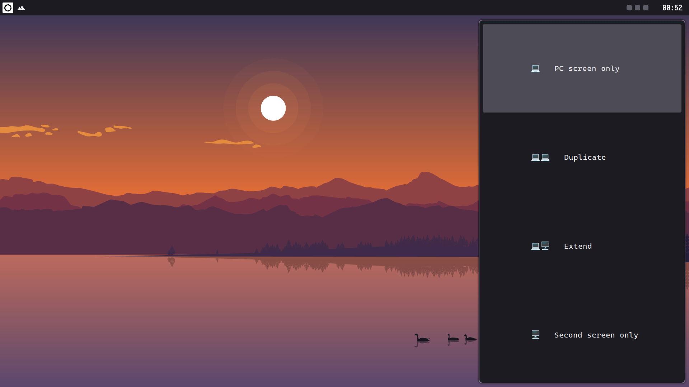
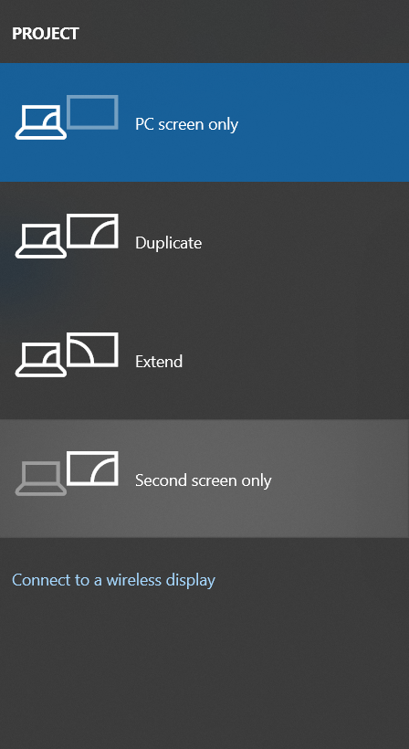
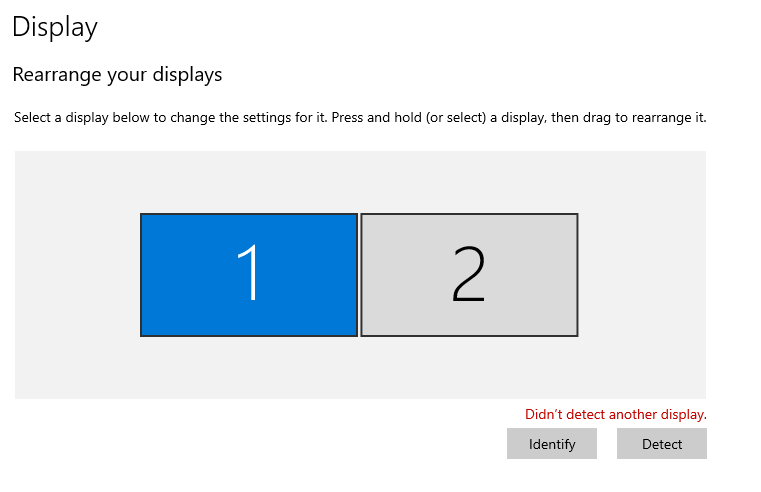
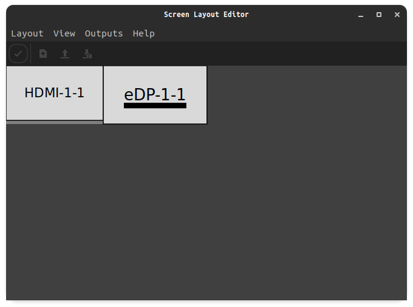

# Project Screen for Linux

<p align="center">
  
  <br>
  <br>
  
</p>

Project screen for Linux is an script that tries to emulate Windows behaviour when trying to project your screen or use another monitor. The main goal is to let you project your screen without wasting time writing a bunch of commands everytime you plug a projector, monitor, tv, etc.

The scripts uses [mons](https://github.com/Ventto/mons) as background to handle profiles. It also uses [XrandR](https://wiki.archlinux.org/title/Xrandr) to detect seondary monitors.

## Flavors

There are two scripts to choose: eye-candy and simple.

- The eye-candy script uses a rasi file to provide a better aspect to the rofi selector. It also provides notifictions through [dunst](https://dunst-project.org/) about the results of the script. If you want the whole Windows experience on Linux, this flavor is for you.
- The simple script has the basic functionality in order to make it work. Without notifications, error displaying, custom rofi configuration, etc. If you just want to share your screen via a rofi menu, this flavor is for you.

## Features

Not only does the script provides mons functionality, but also sets automatically the resolution of the second monitor based on the resolution of the primary one.

#### Aiming to

As a goal for the future, I'm trying to solve [overscan/underscan](https://en.wikipedia.org/wiki/Overscan) automatically, just like Windows does.

## Installation and usage

- Clone the repository to download the files

```shell
git clone git@github.com:LeonN534/Project-Screen-Linux.git
```

- Go to the `src` folder, choose one flavor and copy it to the folder where your user scripts reside. For example:

```shell
cd Project-Screen-Linux
cp src/project-screen-eyecandy.sh ~/.scripts
```

- If you chose the simple flavor, you can add a custom rasi file to the rofi command, so it will look better:

```shell
selected=$(echo "$options" | rofi -dmenu -theme-str '@import "your-custom-config.rasi"' -markup-rows)
```

- If you copied the eye-candy flavor, you need to install the icons, the rofi config file and the rofi theme:

```shell
# For the icons
mkdir -p ~/.icons/project-screen
cp icons/png/* ~/.icons/project-screen
# The rofi config and theme
cp -r src/rofi/* ~/.config/rofi
```

- The final step is to bind a key (usuall `windows + p`) though your window manager ot execute the script.

```shell
# For example, in sxhkdrc
super + p
    ~/.scripts/project-screen-eyecandy.sh
```

## Tips

Just like in Windows, whe win+p utility is not always enough to set a multimonitor set up, that't why Windows has a dedicated settings page to the monitors layout:



To emulate this settings page, I recommend using [ARandR](https://christian.amsuess.com/tools/arandr/), a GUI to manage XrandR. It offers kinf of a similar approach to what Windows has:


